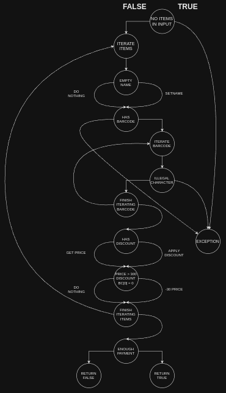

# Втора лабораториска вежба по Софтверско инженерство

## Лука Милиќ, бр. на индекс 215046

### Група на код: 

--

###  Control Flow Graph



Графикот е направен со [draw.io](https://www.drawio.com/)

### Цикломатска комплексност

**Цикломатска комплексност (CC)** се добива со следната формула:

*(CC) = E - N + 2P*

- ( E ) - број на транзиции меѓу нодови.
- ( N ) - број на нодови во графот.
- ( P ) - број на компоненти во кодот.

така да би добиле:

*E* = 20

*N* = 10 - се добива не броејќи ги нодовите кои ознашуваат исклучоци, враќање на почеток на итерација и враќање на `true` или `false`

*(CC) = 20 - 20 + 2 * 1*

Се заклучува дека *CC = **12***

### Тест случаи според критериумот [Every statement](./src/test/SILab2Test.java)

1. testAllItemsNull()
```
// Branch 1: Null allItems list
@Test(expected = RuntimeException.class)
public void testAllItemsNull() {
    SILab2.checkCart(null, 100);
}
```
Овој тест го покрива условот каде што за влез предава `null` вредност се одчекува RuntimeException.class

2. testAllItemsEmpty()
```
// Branch 2: Empty allItems list
@Test
public void testAllItemsEmpty() {
    Item[] allItems = {};
    assertTrue(SILab2.checkCart(Arrays.asList(allItems), 0));
}
```
Овој тест го покрива условот каде шт оза влез се предава празна листа и 0 наплата

3. testItemWithNullNameAndValidBarcode()
```
// Branch 3: Item with null name and valid barcode
@Test
public void testItemWithNullNameAndValidBarcode() {
    Item[] allItems = {new Item(null, "12345", 100, 0)};
    List<Item> itemList = Arrays.asList(allItems);
    assertTrue(SILab2.checkCart(itemList, 100));
    assertEquals("unknown", itemList.get(0).getName());
}
```
Овој тест проверува случај кога името на ставката е `null`, а баркодот е валиден.

4. testItemWithEmptyNameAndValidBarcode()
```
// Branch 4: Item with empty name and valid barcode
@Test
public void testItemWithEmptyNameAndValidBarcode() {
    Item[] allItems = {new Item("", "12345", 100, 0)};
    List<Item> itemList = Arrays.asList(allItems);
    assertTrue(SILab2.checkCart(itemList, 100));
    assertEquals("unknown", itemList.get(0).getName());
}
```
Овој тест проверува случај кога името на ставката е празно, а баркодот е валиден.

5. testItemWithIllegalCharacterInBarcode()
```
// Branch 5: Item with illegal character in barcode
@Test(expected = RuntimeException.class)
public void testItemWithIllegalCharacterInBarcode() {
    Item[] allItems = {new Item("item1", "1234A", 100, 0)};
    SILab2.checkCart(Arrays.asList(allItems), 100);
}
```
Овој тест проверува случај кога во баркодот на ставката се појавува нелегален знак и отчекува RuntimeException.class.

6. testItemWithValidBarcodeAndDiscount()
```
// Branch 6: Item with valid barcode and discount
@Test
public void testItemWithValidBarcodeAndDiscount() {
    Item[] allItems = {new Item("item1", "12345", 100, 0.1)};
    assertTrue(SILab2.checkCart(Arrays.asList(allItems), 10));
}
```
Овој тест проверува случај кога ставката има валиден баркод и попуст.

7. testItemWithValidBarcodeButNoDiscount()
```
// Branch 7: Item with valid barcode but no discount
@Test
public void testItemWithValidBarcodeButNoDiscount() {
    Item[] allItems = {new Item("item1", "12345", 100, 0)};
    assertTrue(SILab2.checkCart(Arrays.asList(allItems), 100));
}
```
Овој тест проверува случај кога ставката има валиден баркод, но нема попуст.

8. testItemWithSpecialDiscountCondition()
```
// Branch 8: Item with special discount condition
@Test
public void testItemWithSpecialDiscountCondition() {
    Item[] allItems = {new Item("item1", "012345", 350, 0.1)};
    assertTrue(SILab2.checkCart(Arrays.asList(allItems), 32.5));
}
```
Овој тест проверува случај кога ставката има специјално условен попуст.

9. testSumGreaterThanPayment()
```
// Branch 9: Sum greater than payment
@Test
public void testSumGreaterThanPayment() {
    Item[] allItems = {new Item("item1", "12345", 100, 0)};
    assertFalse(SILab2.checkCart(Arrays.asList(allItems), 50));
}
```
Овој тест проверува случај кога збирот за плаќање е поголем од вкупната цена на сите ставки.

10. testNoBarcode()
```
// Branch 10: Item with no barcode
@Test(expected = RuntimeException.class)
public void testNoBarcode() {
    Item[] allItems = {new Item("item1", null, 100, 0)};
    SILab2.checkCart(Arrays.asList(allItems), 100);
}
```
Овој тест проверува случај кога ставката нема баркод и отчекува RuntimeException.class.

11. testItemWithPriceOver300AndSpecialDiscount()
```
// Branch 11: Item with price > 300, discount > 0, and barcode starting with '0'
@Test
public void testItemWithPriceOver300AndSpecialDiscount() {
    Item[] allItems = {new Item("item1", "012345", 350, 0.1)};
    assertTrue(SILab2.checkCart(Arrays.asList(allItems), 32.5));
}
```
Овој тест проверува случај кога ставката има цена поголема од 300, попуст поголем од 0 и баркод кој почнува со '0'.

12. testItemWithPriceOver300AndNoDiscount()
```
// Branch 12: Item with price > 300, discount == 0, and barcode starting with '0'
@Test
public void testItemWithPriceOver300AndNoDiscount() {
    Item[] allItems = {new Item("item1", "012345", 350, 0)};
    assertFalse(SILab2.checkCart(Arrays.asList(allItems), 350));
}
```
Овој тест проверува случај кога ставката има цена поголема од 300, попуст е 0 и баркод кој почнува со '0'.
